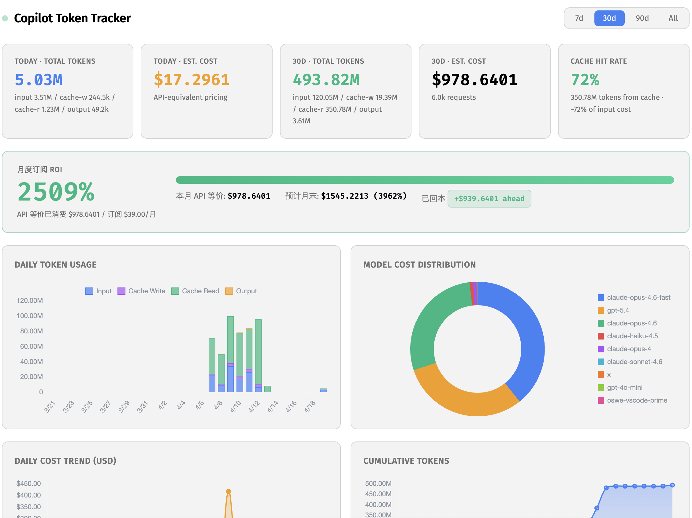

# Copilot Token Tracker

简体中文 | [English](README.en.md)

玩 AI 来 linux.do


通过解析 Copilot Chat 的追踪日志，追踪 **真实** 的 GitHub Copilot Token 使用情况，包括实际的 API Token 计数、成本估算、投资回报率（ROI）跟踪以及按模型和类别的使用情况细分。

与通过本地 Tokenizer 估算的插件不同，此扩展直接读取 Copilot API 返回的 `prompt_tokens` / `completion_tokens` 值（支持 OpenAI 和 Anthropic 格式）。



## 功能

### 仪表盘
- **5 个统计卡片** — 今日 Token、今日成本、范围内 Token、范围内成本、缓存命中率
- **ROI 跟踪器** — 将您的实际 API 等效成本与 Copilot 订阅费用进行比较，查看真实价值
- **4 个交互式图表** — 每日 Token 使用量（堆叠柱状图）、模型成本分布（环形图）、每日成本趋势（折线图）、累计 Token（面积图）
- **按类别使用情况** — 按聊天、子代理、内部和未知分类的使用情况细分
- **按模型使用情况** — 每个模型的 Token 计数、请求计数和成本
- **API 定价参考** — 完整的模型定价表

### Token 跟踪
- **准确计数** — 从追踪日志中读取实际 API 使用值
- **缓存 Token 支持** — 分别跟踪缓存创建、缓存读取和标准输入/输出 Token
- **快速模式检测** — 识别并定价快速模式模型变体（例如 `claude-opus-4.6-fast`）
- **多格式解析** — 支持 OpenAI（`prompt_tokens`/`completion_tokens`）和 Anthropic（`input_tokens`/`output_tokens` + 缓存字段）格式
- **类别跟踪** — 通过 `ccreq` 关联将使用分类为聊天、子代理、内部或未知

### 状态栏
- **实时成本显示** — 在状态栏显示今日估算成本
- **ROI 百分比** — 颜色编码的 ROI 指示器（绿色表示 ≥ 100%）
- **点击打开** — 打开完整仪表盘

### 设置
- **日期范围** — 7 天 / 30 天 / 90 天 / 所有时间
- **可配置订阅** — 设置您的月度 Copilot 成本以进行准确的 ROI 计算
- **自动启用追踪** — 尝试在启动时自动启用追踪日志记录

## ⚠️ 必需：启用追踪日志记录

只有在 Copilot Chat 扩展以 **Trace** 级别记录日志时，Token 数据才会出现。扩展会尝试自动启用此功能，但您也可以手动启用：

1. 打开命令面板（`⌘⇧P` / `Ctrl⇧P`）
2. 运行 `Developer: Set Log Level...`
3. 选择 **GitHub Copilot Chat**
4. 选择 **Trace**

> **注意：** Trace 日志非常详细。扩展仅从中读取 Token 使用数据。

## 安装

从 `.vsix` 文件安装：

```bash
code --install-extension copilot-token-tracker-1.0.0.vsix
```

或从源码构建：

```bash
git clone https://github.com/pikapikaspeedup/Copilot-Token-Tracker.git
cd copilot-token-tracker
npm install
npm run compile
npx @vscode/vsce package --no-dependencies
code --install-extension copilot-token-tracker-1.0.0.vsix
```

## 命令

| 命令 | 描述 |
|---------|-------------|
| `Copilot Token Tracker: Open Dashboard` | 打开 Token 使用仪表盘 |
| `Copilot Token Tracker: Reset All Data` | 清除所有存储的使用数据 |
| `Copilot Token Tracker: How to Enable Trace Logging` | 弹出启用追踪日志记录的说明 |

## 工作原理

1. 激活时，扩展会根据其自身的 `context.logUri` 定位 GitHub Copilot Chat 日志文件（支持 VS Code 稳定版和 Insiders 版）。
2. 它通过 `fs.watch()` 监视文件并跟踪新内容，扫描 OpenAI 和 Anthropic SSE 格式中的 `"usage"` JSON 对象。
3. Token 事件与 `ccreq` 行（500 毫秒窗口内）相关联，以确定使用类别（聊天 / 子代理 / 内部）。
4. 模型名称从多种日志行类型（`message_start`、`ccreq` 信息、调试行）中缓存，以确保准确归属。
5. 事件按日期、模型和类别存储在 VS Code 的 `globalState` 中，自动修剪至 365 天。
6. 状态栏和仪表盘在每个新事件时实时更新。

## 成本估算

显示的成本是基于公开列表定价（每百万 Token 的美元）的 **API 等效估算**。它们 **不** 代表您的实际 GitHub Copilot 订阅成本（这是固定的月费）。使用这些数字来了解：
- 相对于订阅的价值（ROI）
- 哪些模型消耗了最多预算
- 缓存命中是否为您节省了资金

## 设置

| 设置 | 默认值 | 描述 |
|---------|---------|-------------|
| `copilotTokenTracker.enabled` | `true` | 启用/禁用跟踪 |
| `copilotTokenTracker.showStatusBar` | `true` | 在状态栏显示成本和 ROI |
| `copilotTokenTracker.defaultModel` | `claude-3-5-sonnet` | 成本估算的回退模型 |
| `copilotTokenTracker.monthlySubscriptionCost` | `39` | 您的月度 Copilot 订阅成本（美元），用于 ROI 计算 |

## 支持的模型

GPT-5.4、GPT-5.4-mini、GPT-5.4-nano、GPT-4o、GPT-4o-mini、Claude Opus 4.7、Claude Opus 4.6（+ 快速版）、Claude Sonnet 4.6/4.5/4、Claude Haiku 4.5/3.5、o3-mini、o1 等。

## 许可证

MIT
